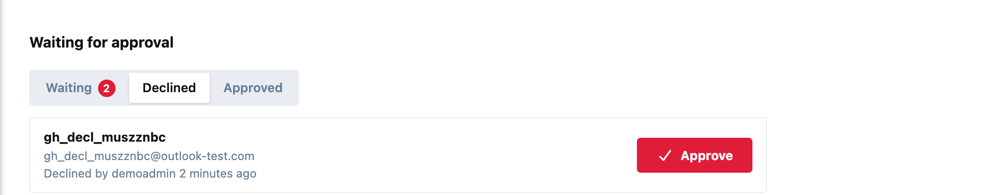
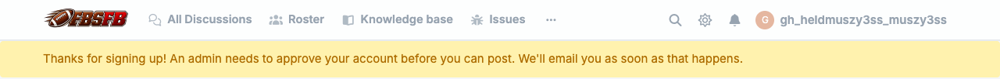
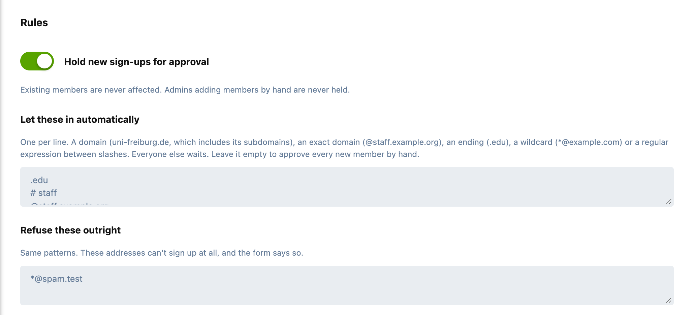

# Gatehouse

Approve new members before they get in. Sign-ups from addresses you trust activate as normal; everyone else waits in a queue until an admin approves or declines them.

Made for forums with an eligibility rule (a university, a club, a company, a private group), and just as useful against a wave of spam sign-ups.



## How it works

- **Trusted addresses walk straight in.** List the domains you trust, such as `.edu`, `uni-freiburg.de` or `@staff.example.org`. Those sign-ups get the normal activation email and carry on as usual.
- **Everyone else waits.** They can sign up, but until an admin approves them they have exactly a visitor's permissions: they can read what a guest can, and post nothing. A notice at the top of the forum tells them why.
- **They hear about it.** Applicants get an email saying their account is being reviewed, with any extra text you add, for example *"reply with your student ID"*. Admins get a notification and an email with a link to the queue.
- **One click to decide.** **Approve** sends the applicant their activation link and lets them in. **Decline** emails them, and they can't sign in. A declined applicant can still be approved later.
- **Refuse addresses outright.** A second list turns addresses away at the sign-up form, before any account is made.



## Patterns

One per line, in either list:

| Pattern | Matches |
|---|---|
| `uni-freiburg.de` | that domain and its subdomains, never a look-alike such as `baduni-freiburg.de` |
| `@zv.uni-freiburg.de` | exactly that domain |
| `.edu`, `.ac.uk` | any domain ending that way |
| `*@example.com` | a wildcard over the whole address (`*` and `?`) |
| `/^staff\..+@example\.org$/i` | a regular expression between slashes |

Lines starting with `#` are comments. **Leave the first list empty to approve every new member by hand.**



## Good to know

- **Existing members are never affected**, and nor are members an admin adds by hand. The check happens once, at sign-up; changing an email address later doesn't send anyone back to the queue.
- **The lock is the permissions, not the email.** Flarum signs a new member in as soon as they register, and an activation link can be requested again from the forum. So while waiting or declined, a member's permissions are those of a visitor, whatever happens with their email.
- **No hint to strangers.** Signing in as a waiting or declined member explains why only when the password is right. With a wrong password it's Flarum's usual "incorrect" message, so the form can't be used to find out who applied.
- **The activation link waits too.** Applicants aren't sent the activation link at sign-up; it comes with the approval, so confirming the address and being let in happen together.
- **Email is best-effort.** If the mail server is down, the applicant is still held; the failure is logged.

## Installation

```sh
composer require ernestdefoe/gatehouse
php flarum migrate
php flarum cache:clear
```

Then enable **Gatehouse**, switch on **Hold new sign-ups for approval** and fill in the lists.

## Updating

```sh
composer update ernestdefoe/gatehouse
php flarum migrate
php flarum cache:clear
```

## Licence

MIT. See [LICENSE](LICENSE).
